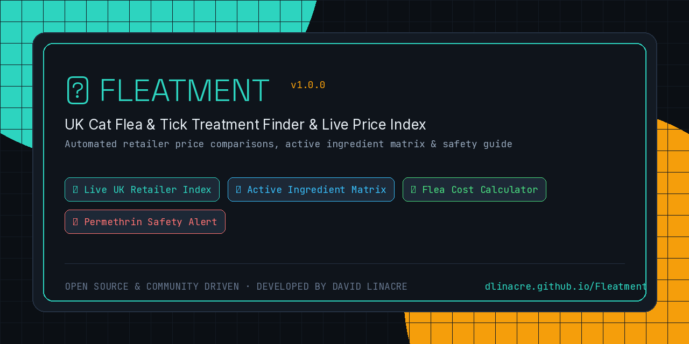

# Fleatment 🐱 — UK Cat Flea & Tick Index, Live Price Finder & Safety Guide



[](https://github.com/DLinacre/Fleatment/releases/tag/v1.0.0)
[](LICENSE)
[](https://dlinacre.github.io/Fleatment/)
[](https://www.linacre.site)

**Fleatment** is an open-source, client-side web application and live price index designed to help UK cat owners quickly find the safest, most affordable, and most effective flea and tick treatments for their cats.

---

## ⚡ Key Features

### 🛒 1. Live UK Retailer Price Comparison
Automated delivered price calculation including UK VAT and standard postage across top verified veterinary stockists:
* **Pets at Home** (Click & Collect 1-hour availability)
* **Animed Direct**
* **Pet Drug Online**
* **VioVet**
* **Amazon UK**

Calculates true **per-dose cost** (`(Product Cost + Delivery) / Total Doses`) to uncover real value beyond misleading shelf stickers.

### 🧮 2. Interactive Flea Cost & Savings Calculator
Select your household cat count (1–4+ cats) and chosen treatment to receive instant monthly and annual total projections, alongside retailer savings highlights.

### ⚗️ 3. Active Ingredient & Mechanism Matrix
Detailed veterinary breakdown comparing active pharmaceutical ingredients:
* **Imidacloprid** (*Advantage, Seresto*) — Rapid contact knockdown without biting.
* **Fipronil** (*Frontline, FIPROtec*) — Central nervous system GABA channel blocker.
* **Nitenpyram** (*Capstar*) — Oral 30-minute adult flea knockdown.
* **(S)-methoprene** (*Frontline Plus*) — Insect Growth Regulator (IGR) breaking egg/larvae cycles.

### ⚠️ 4. Permethrin Safety Warning Alert
Explicit warnings highlighting that **canine flea treatments containing Permethrin are lethal to cats**. Includes emergency mitigation steps for accidental exposure.

---

## 🔄 How Live Data Auto-Fetching Works

When `index.html` loads, it executes an asynchronous client-side fetch targeting `data/treatments.json`:

```javascript
async function init() {
  try {
    const res = await fetch('data/treatments.json');
    if (res.ok) {
      const json = await res.json();
      treatmentsData = json.products || [];
    }
  } catch (e) {
    // Graceful offline fallback to inline dataset
  }
  renderTable();
  populateCalculator();
}
```

If offline or opened as a local file, the app seamlessly falls back to an embedded static dataset, ensuring 100% network resilience in any browser.

---

## 📁 Repository Structure

```
Fleatment/
├── index.html               # Main single-file app & live price index
├── data/
│   └── treatments.json      # Structured JSON database of treatments & prices
├── assets/
│   └── banner.png           # High-resolution social header banner
├── LICENSE                  # MIT License
└── README.md                # Documentation & developer guide
```

---

## 🚀 Updating Prices & Adding Products

To update prices or add a new flea product:
1. Open `data/treatments.json`.
2. Locate the product object in `products` array.
3. Edit retailer price, delivery fee, or add a new retailer block:

```json
{
  "name": "New Stockist",
  "price": 14.99,
  "delivery": 2.99,
  "url": "https://example-vet.co.uk",
  "in_stock": true
}
```
4. Commit and push! The live comparison table and cost calculator will recalculate automatically on next page load.

---

## 📜 License & Veterinary Disclaimer

Distributed under the **MIT License**. Created by **David Linacre** ([linacre.site](https://www.linacre.site)).

*Disclaimer: Fleatment is an independent price comparison index and educational reference guide. Always consult a licensed veterinary surgeon for diagnostic and prescription guidance regarding animal parasite management.*
